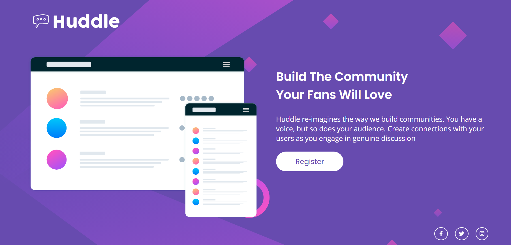

# 😉 Projeto Hudlle
Foi um desafio proposto pelo Dev quest através do Frontend Mentor ( https://www.frontendmentor.io ) que testa o conhecimento de css e html avançado.

# Dificuldades
Tive dificuldade de ajustar o background, para deixar em um tamanho bom. Outra pequena dificuldade foi ajustar o poisicionamento de alguns items no responsivo.

# Linguagens utilizadas
- CSS
- HTML

# Versão final Desktop 💻

